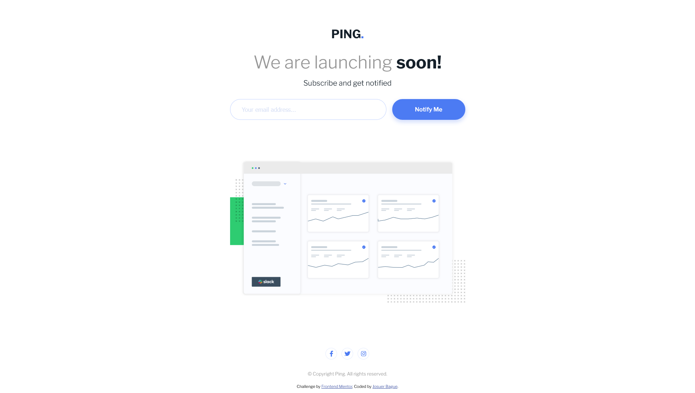
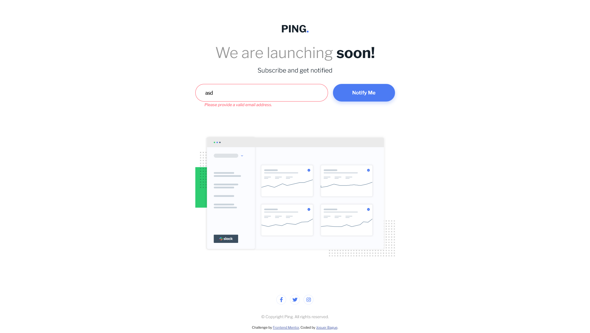
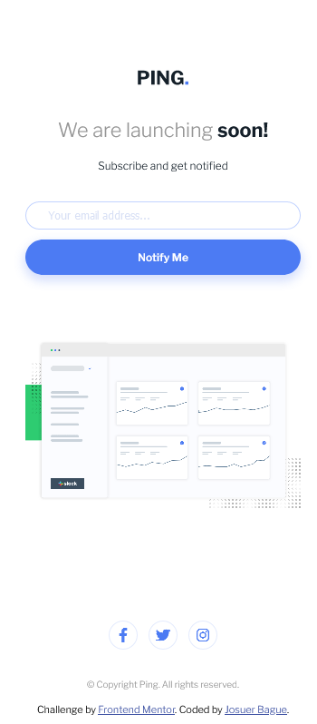
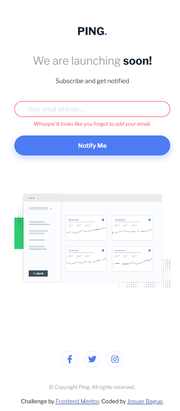

# Frontend Mentor - Ping coming soon page solution

This is a solution to the [Ping coming soon page challenge on Frontend Mentor](https://www.frontendmentor.io/challenges/ping-single-column-coming-soon-page-5cadd051fec04111f7b848da). Frontend mentor challenges help you improve your coding skills by building realisitic projects.

## Table of contents

- [Overview](#overview)
  - [The challenge](#the-challenge)
  - [Screenshot](#screenshot)
  - [Links](#links)
- [My process](#my-process)
  - [Built with](#built-with)
  - [What I learned](#what-i-learned)
  - [Continued development](#continued-development)
  - [Useful resources](#useful-resources)
- [Author](#author)

## Overview

Users should be able to:

- View the optimal layout for the site depending on their device's screen size
- See hover states for all interactive elements on the page
- Submit their email address using an `input` field
- Receive an error message when the `form` is submitted if:
	- The `input` field is empty. The message for this error should say *"Whoops! It looks like you forgot to add your email"*
	- The email address is not formatted correctly (i.e. a correct email address should have this structure: `name@host.tld`). The message for this error should say *"Please provide a valid email address"*

### Screenshots

#### Desktop View

#### Mobile View

### Links

- Solution URL: [Github Repo](https://github.com/JoshDagat/FM---Ping)
- Live Site URL: [Ping - Coming Soon](https://joshdagat.github.io/FM---Ping/)

## My process

As always I started with the HTML, making sure the skeleton was in place. After that I went ahead with the CSS.

I went down a rabbit hole reading about the pros and cons of validating e-mail addresses via javascript.

In the end I opted to go with javascript valdiation because of the better customization for showing errors.

### Built with

- HTML
- CSS
- Flexbox
- Mobile-first workflow
- Google Fonts
- Font-Awesome

### What I learned

I learned that there is a divide on how emails should be validated. Some people say javascript should be enough for simple use-cases, others say it's better to send an email verification link, while others say we should just use built in HTML5 validation.

All points had their merits, but for this project I decided to go with regex for javascript validation. According to [Regular-Expressions.info](https://www.regular-expressions.info/email.html), 99% of the time, a simple regexx should suffice for most use-cases.

### Continued development

I'll look into learning PHP then use that for server-side validation.

### Useful Resources

[Regular-Expressions.info](https://www.regular-expressions.info/email.html)

[Email Validation - Stack Overflow](https://stackoverflow.com/questions/46155/how-to-validate-an-email-address-in-javascript)

[Input MDN](https://developer.mozilla.org/en-US/docs/Web/HTML/Element/input)

## Author 
- LinkedIn - [Josuer](https://www.linkedin.com/in/josuer-bague/)
- Frontend Mentor - [FM Josuer Bague](https://www.frontendmentor.io/profile/JoshDagat)
